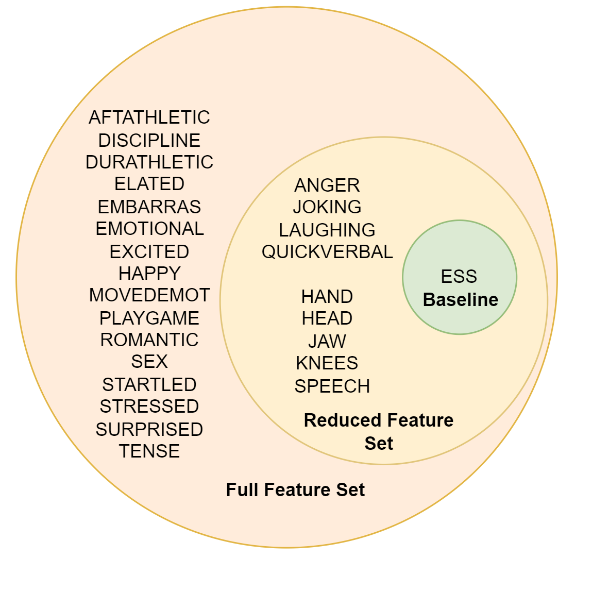
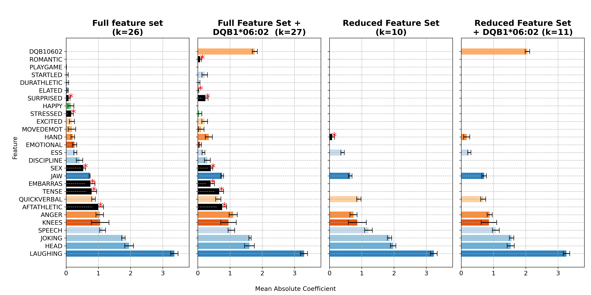
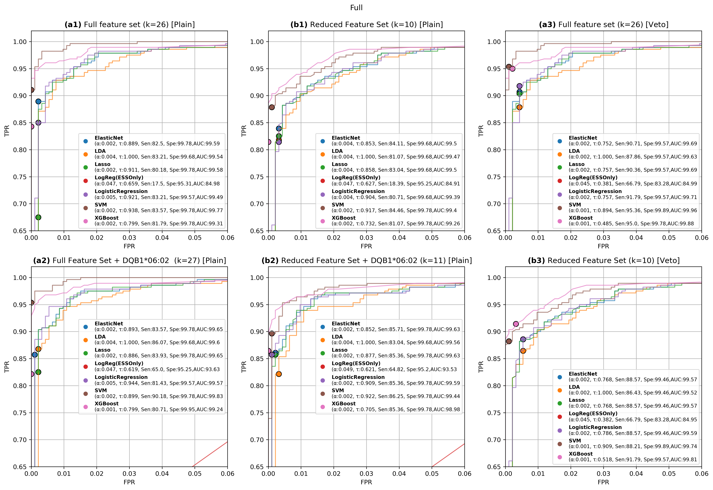

Here is a professional and visually informative `README.md` file for your second NT1 machine learning project, structured to highlight your expertise in both **machine learning** and **sleep medicine**, and to align with the scientific content of your manuscript:

---

# 🧠 Narcolepsy Type 1 Classification via Cataplexy Questionnaire and HLA Typing

## 🔬 Project Objective

This project implements and evaluates machine learning models for the **classification of Narcolepsy Type 1 (NT1)** using features derived from the Stanford Cataplexy Questionnaire and HLA-DQB1\*06:02 genotyping. The aim is to develop a **scalable, accurate screening tool** for NT1 suitable for large datasets such as the UK Biobank.

We demonstrate that elastic net models trained on a small set of high-specificity cataplexy features and refined via HLA veto logic achieve **high specificity (>99%) and high sensitivity (>85%)**, offering a clinically viable alternative to more resource-intensive diagnostics like MSLT.

## Feature Sets
Venn diagram illustrating the overlap between the full questionnaire feature set (k=26) and the reduced feature set (k=10), excluding the HLA-DQB1*06:02 allele. Both feature sets were also evaluated with the addition of the HLA genotype (k=27 and k=11). Resulting in four feature sets to evaluate by each model. The reduced set includes emotional triggers (anger, joking, laughing, quick verbal response), muscle weakness locations (hand, jaw, knees, speech), and the Epworth Sleepiness Scale (ESS) score.
<p align="center">
  
</p>

---

## 🧭 Pipeline Overview

The ML pipeline is implemented in modular Python scripts and follows this sequence:

1. **`pre_processing.py`**

   * Loads raw questionnaire data
   * Performs feature selection (full or reduced set)
   * Encodes binary features
   * Applies Bayesian Ridge imputation for missing values
   * Splits data into training and validation sets

2. **`generate_table_one.py`**

   * Computes descriptive statistics for NT1 and control groups
   * Generates Table 1: statistical tests and effect sizes for clinical variables

3. **`optmize_xgboost_loss_weight.py`**

   * Performs loss weight optimization for XGBoost to penalize false positives
   * Outputs best trade-off between specificity and sensitivity


4**`main_full_and_cross_val.py`**

   * Trains and evaluates ML models (Elastic Net, XGBoost, etc.)
   * Performs full and stratified 5-fold cross-validation
   * Selects optimal specificity-weighted thresholds


5. **`ess_cutoff_model.py`**

   * Evaluates ESS-based logistic models as baseline
   * Compares rule-based vs ML-based approaches

6. **`roc_curve_plots_veto_tresh.py`**

   * Applies post-hoc veto rule using HLA-DQB1\*06:02 status
   * Plots ROC curves across feature sets and models
   * Outputs stage I and II ROC visualizations

---

## 📊 Key Results

### ✅ Best Model Performance (Reduced Feature Set, k=10)
Results metrics from Stage II.

| Method        | Specificity (%) | Sensitivity (%) |
| ------------- | --------------- | --------------- |
| Elastic Net   | **99.68**       | 84.29           |
| With HLA veto | 99.14           | **87.86**       |

Adding HLA-DQB1\*06:02 as a post-hoc veto significantly increased sensitivity with only a marginal drop in specificity—ideal for large-scale screening scenarios.

---

## 🖼️ Figures

### 🔍 Elastic Net Feature Importance
Analyzing feature importance analysis using the Elastic Net model (Figure 4) revealed a consistent pattern across all four feature configurations. Emotional triggers such as laughing, joking, and anger ranked among the top features based on their regularized weights. Similarly, muscle weakness features, particularly head drooping, knee buckling, and speech slurring also exhibited high model coefficients. This co-occurrence of high-weighted emotional triggers and muscle weakness features across feature set configurations reflects a robust association of dominant muscle weakness and emotional triggers that are consistently present in NT1 cases. In contrast, certain features had negative coefficients, indicating inverse association with NT1. These included after athletic activities, tense, and embarrassment. These findings further validate the design of the Reduced Feature Set (k=10), which effectively captures the most predictive cataplexy-related features without the need for excessive questioning.
<p align="center">
  
</p>


### 📈 ROC Curve with Veto Threshold
In Stage I, we evaluated machine learning models for narcolepsy type 1 (NT1) classification using different feature configurations and thresholds. The highest performance was observed with Elastic Net using the full feature set and HLA-DQB106:02 biomarker, achieving 83.75% sensitivity and 99.78% specificity (AUC 99.61%). Notably, applying a post-hoc veto rule to models trained without HLA yielded comparable performance, with Elastic Net reaching 90.71% sensitivity and 99.57% specificity. These findings demonstrate the strong discriminative power of HLA-DQB106:02 and support the veto rule as an effective post-hoc strategy in scenarios where biomarker data is unavailable.

<p align="center">
  
</p>

---

## 📁 Project Structure

```
.
├── pre_processing.py             # Data loading, cleaning, feature selection
├── generate_table_one.py        # Descriptive stats and group comparisons
├── main_full_and_cross_val.py   # Core model training and validation
├── optmize_xgboost_loss_weight.py # Optimize FP/TP trade-offs for XGBoost
├── ess_cutoff_model.py          # Rule-based baseline from ESS
├── roc_curve_plots_veto_tresh.py# Post-hoc HLA-veto logic and ROC plots
├── figures/
│   ├── elastic_net_feature_importance.png
│   └── roc_curve_veto.png
├── results/
│   └── model_metrics.csv
└── README.md
```

---


## 💡 Citation

If you use this repository, please cite our paper once published. For early reference:

```bibtex
@unpublished{ricciardiello2025nt1,
  title={Optimizing Machine Learning Classification of Narcolepsy Type 1 Using the Stanford Cataplexy Questionnaire and HLA-DQB1*06:02 Biomarker},
  author={Ricciardiello Mejia, Giorgio and Brink-Kjaer, Andreas and Mignot, Emmanuel},
  year={2025},
  note={Manuscript in preparation}
}
```
