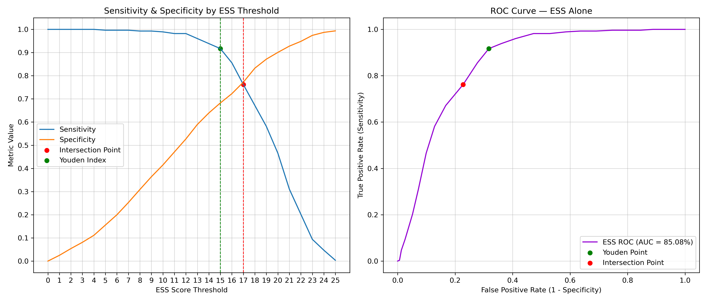

# README.md

# **Optimizing Machine Learning Classification of Narcolepsy Type 1 Using the Stanford Cataplexy Questionnaire and HLA-DQB1*06:02 Biomarker**

## **Abstract**

**Background**: Narcolepsy type 1 (NT1) is characterized by sleepiness, disturbed sleep, and cataplexy—episodes of sudden muscle tone loss triggered by emotions. Accurate diagnosis in large-scale studies remains challenging due to NT1’s low prevalence and reliance on polysomnography. Prior studies have shown that cataplexy-related questions can help identify genuine cataplexy. This study investigates whether a brief cataplexy questionnaire can support scalable NT1 screening.

**Methods**: We analyzed responses from 280 NT1 patients and 927 controls from the Stanford narcolepsy database. We trained six ML classifiers using 10- and 27-item cataplexy feature sets (emotional triggers, affected muscles), Epworth Sleepiness Scale (ESS) with and without HLA-DQB106:02 typing. Model was trained with nested cross-validation and Optuna optimization. A post hoc veto rule reclassified any subject predicted as NT1 but lacking the HLA-DQB106:02 allele as non-NT1 to reduce false positives when HLA was not part of the feature set. Given the low prevalence of NT1, optimization prioritized specificity.

**Results**: ESS obtained an AUC of 0.863 (95% CI: 0.840–0.885) with sensitivity of 39.9% and specificity of 92.1%. The reduced feature set with (k = 11) and without (k=10) HLA obtained similar AUCs of 0.995 (95% CI: 0.993–0.998). The full feature set with (k=28) and without (k=27) HLA obtained a similar AUCs of 0.996 (95% CI: 0.995–0.998). Inclusion of HLA corrected false positives increasing specificity up to 98.8%, 99.0% and 99.2%, respectively.

**Conclusions**: ML applied to cataplexy questionnaire and HLA typing enables scalable NT1 screening. Further population-based validations are needed to confirm these findings using larger samples of controls.
Keywords: Cataplexy, Questionnaire, UK Biobank, ML, Muscle Weakness, DQB10602.

---

# **Relevance**

* Provides a low-cost, scalable pre-screening tool for NT1
* Useful for large cohorts such as **UK Biobank**, **digital sleep platforms**, and **public health populations**
* Demonstrates how **clinically structured questionnaires + minimal genotype** can approximate performance of resource-heavy diagnostics
* Introduces reproducible ML methodology, pairing HLA vs non-HLA models with a biologically justified correction rule

## **Model Features**

<p align="center">
  
</p>

**Caption:**
Figure 1. Venn diagram illustrates the overlap between the full questionnaire feature set (k = 26) and the reduced feature set (k = 10), excluding the HLA-DQB1*06:02 allele. Both feature sets were also evaluated with the addition of the HLA genotype (k=27 and k=11). Resulting in four feature sets to evaluate by each model. The reduced set includes emotional triggers (anger, joking, laughing, quick verbal response), muscle weakness locations (hand, jaw, knees, speech), and the Epworth Sleepiness Scale (ESS) score. 

---

## **Best Performing Models*

<p align="center">
  
</p>

**Caption:**
Figure 2. ROC curves and confusion matrices of the best-performing models across the ESS (K=1), ESS + DQB106:02 (K=2),  full feature set (k = 27), full feature set + DQB106:02 (k = 28), reduced feature set (k = 10), and reduced feature set + DQB106:02 (k = 11) configurations. Confusion matrices depict the classification at the obtained thresholds at training, with non-HLA feature set at the first row, HLA feature sets at the second row, and veto-corrected predictions from non-HLA feature set at the third row. Models incorporating HLA-DQB1*06:02 achieved an average specificity of 98%, while those without HLA resulted with more false positives (average specificity of 96%). Application of the veto rule corrected 81 false positives in the ESS feature set, one in the full feature set (k = 27) set, and none in the Reduced feature set. Random Forest (RF); Linear Discriminant Analysis (LDA); Support Vector Machine (SVM)
---

## **Feature Importance**

<p align="center">
  
</p>

**Caption:**
Figure 3. Normalized SHAP feature importances for the best-performing model in each feature set configuration. Emotional triggers such as laughing and joking were the strongest predictors of NT1, followed by muscle weakness features (head, knees) and ESS score. Incorporation of HLA-DQB106:02 increased its relative contribution, particularly in the Reduced feature sets, underscoring its high discriminative value alongside symptom-based features.
---

# **Code Architecture**

The repository is organized for **clarity, modularity, and reproducibility**, mirroring best practices for clinical ML research.

```
project/
│
├── main_cv.py                    # Main pipeline: nested CV, Optuna, metrics, veto, plots
│
├── config/
│   └── config.py                 # Paths and run configuration
│
├── library/
│   └── ml_questionnaire/
│       ├── training.py           # Nested CV + Optuna search (models, pipelines, folds)
│       ├── scoring.py            # Metrics, CI, model selection, thresholding
│       ├── veto_rule.py          # HLA-negative FP correction + metric recomputation
│       ├── visualization.py      # ROC, CM, HLA-vs-nonHLA, PPV plots
│       └── shap_im_pipeline.py   # SHAP interpretability for tree models
│
└── results_git/                  # Figures used in manuscript and README
```

---

# **Pipeline Overview**

## **Run Analysis**

```python
    main_cv.py
```

* Imports questionnaire categorical variables
* Normalizes continuous variables (ESS, BMI, MSLT where available)
* Removes columns with excessive missingness
* Generates:

  * Full feature set
  * UKBB-compatible reduced set
  * ESS-only baselines
  * Each with ± HLA

Features are kept consistent across all model families.

---

## **Training Pipeline**

The project utilizes the ml_questionnaire library to compute the training pipeline with k-folds cross validation
```python
    library/ml_questionnaire/training.py
```

The pipeline evalute the models:
* Random Forest
* LightGBM
* XGBoost
* Elastic Net
* Logistic Regression
* SVM
* LDA

I perform an inner loop with 
* Optuna TPE sampler (250–300 trials)
* Maximizes AUC or specificity, depending on configuration

* and produces the output files

* `metrics_outer_folds.csv`
* `predictions_outer_folds.csv`
* Full hyperparameter history
* Per-fold validation records

The scoring function for the predictions are defined in 
```python
    library/ml_questionnaire/scoring.py
```
The script implements:

* Youden J
* Maximum specificity (spec_max)
* Probability cutoff 0.5
* Sensitivity/specificity CI
* Best-model selection per feature set (`select_best_model_type_per_config`)

For the `veto_rule.py`

> If model **did not train with HLA**, then:
> **HLA-negative false positives are flipped to negative.**

Outputs:

* `df_predictions_with_veto.parquet`
* `df_metrics_with_veto.parquet`
* `veto_count.csv`

The final visualizations are computed by the `visualization.py` script.

# **Reproducibility**

* Fixed random seed (`42`)
* Deterministic Optuna sampling
* Full logging of hyperparameters
* Exact model configurations stored for manuscript replication
